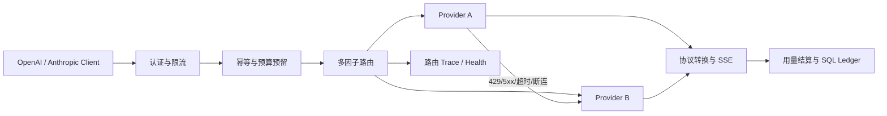

# RouteSmith 多模型智能网关：架构复审与面试材料

## 1. 项目定位

RouteSmith 是面向内部 AI 应用的模型访问网关，不是 Agent。它统一 OpenAI/Anthropic 协议、模型路由、认证、限流、预算、幂等、用量账本、Provider 健康状态和故障转移，使上层应用只依赖一个稳定端点。

## 2. 本次升级内容

- 从静态别名映射升级为候选路由计划，同一别名可绑定多个 Provider。
- 以质量、价格、EWMA 延迟和历史可靠性形成可解释分数，支持 `BALANCED`、`QUALITY`、`ECONOMY`、`LATENCY` 四种策略。
- 返回路由、策略、分数和降级次数响应头，并提供脱敏的管理端路由 Trace。
- Provider 连续失败达到阈值后打开熔断器；429、5xx、超时和传输错误可切换到下一候选。
- 一次用户请求只预留一次 token 预算，跨 Provider 尝试不重复占用；成功后按真实 usage 结算，失败释放。
- 修复级联失败中的重复重试：首选 503、备用断连时，每个候选最多执行一次，终态明确返回 502。

## 3. 路由公式与边界

归一化证据包括：

- `quality`：Provider 静态质量基线。
- `cost`：输入/输出单价的反向归一化值。
- `latency`：配置延迟与运行时 EWMA 延迟形成的反向值。
- `reliability`：带平滑项的历史成功率。

各策略只改变权重，不改变候选资格。熔断中的 Provider 不参与排序。当前实现适合单机或小规模可信网络；健康状态和路由 Trace 是进程内状态，集群部署需要迁移到共享状态与指标系统。

## 4. 测试与真实联调

### 自动化测试

12 个测试覆盖：

- OpenAI/Anthropic 请求、响应和 Tool Call 转换。
- 幂等、月度 token 预算预留/结算/释放。
- 四种路由策略和熔断后的候选剔除。
- 首选节点连续两次 503 后打开熔断，后续请求直接绕过。
- 首选 503 且备用网络断连时，每个候选只尝试一次并返回 502。
- 同协议 SSE 透传和跨协议有限响应流化。

### DeepSeek 实际请求

2026-08-09 在开发机启用单个 DeepSeek Provider，取最终 BuySense 基准产生的最近 8 条路由 Trace：

| 指标 | 结果 |
|---|---:|
| 请求数 | 8 |
| 成功数 | 8 |
| 降级次数 | 0 |
| Provider P50 | 1222 ms |
| Provider P95 | 1410 ms |

这是功能与延迟烟测，不是吞吐压测。单 Provider 场景无法证明真实跨厂商 SLA；故障转移正确性由 MockWebServer 集成测试验证。

## 5. 方案复审结论

RouteSmith 不需要改造成 Agent。它的价值在确定性基础设施：协议兼容、策略路由、配额、账本、失败隔离和证据。LLM 不应参与每次网关路由判断，否则网关自身会引入额外成本、延迟和循环依赖。

下一阶段可演进为 Redis/数据库共享健康状态、半开探测、并发隔离、Provider 凭据池、OpenTelemetry 和压测基线，但这些不在当前完成范围内。

## 6. 面试高频追问

### 为什么不是简单 Nginx 反向代理？

因为模型协议、Tool Call、SSE、token 预算、幂等缓存和 Provider 级路由都需要理解请求语义，普通四层或七层转发无法完成这些治理。

### 为什么路由不用 LLM？

网关必须低延迟且不能依赖它正在代理的模型。可解释评分可回放、可压测、可降级，也不会形成调用环。

### 预算为什么只预留一次？

Provider fallback 是同一个用户请求的多次尝试。每次重试都预留会重复占用额度；正确做法是请求级预留，最终按一次成功 usage 结算。

### SSE 中途失败为什么不切换 Provider？

客户端一旦收到部分 token，再切换模型会产生重复或语义不一致。当前只在流打开前 fallback，流打开后的错误记录健康状态并释放未结算预算。

### 熔断恢复怎么处理？

当前过期后允许候选重新进入，相当于轻量半开；若再次失败会立即重新打开。生产集群应增加有限探测并共享状态。

### 如何证明不会无限重试？

路由计划是有限有序列表，每次只递增索引。新增的级联失败测试验证首选 503、备用断连时请求数恰好为 1 + 1。
