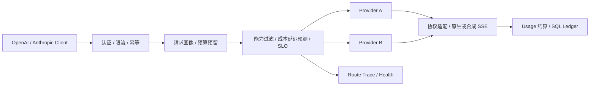

# RouteSmith 多模型智能网关：架构复审与面试材料

## 1. 项目定位

RouteSmith 是面向内部 AI 应用的模型访问网关，不是 Agent。它统一 OpenAI/Anthropic 协议、请求感知路由、认证限流、预算、幂等、用量账本、Provider 健康状态和故障转移，使上层应用只依赖一个稳定端点。

## 2. 本次升级

- 从全局 Provider 打分升级为请求感知路由，路由输入包含预计输入 token、最大输出 token、Tool 数量、是否流式、客户端协议及可选延迟 SLO。
- 在打分前执行硬能力过滤：上下文窗口不足、缺少 Tool 能力或不支持同协议原生流式的 Provider 不进入候选。
- 由请求规模与 Provider 输入/输出单价计算预计成本，由 Prefill/Decode 吞吐和运行时 EWMA 估算请求延迟；候选证据同时保留归一化分数与原始预测值。
- 支持 `x-modelport-latency-slo-ms`。满足 SLO 的候选优先排序，超限候选保留为故障兜底并标记 `slo_met=false`；全部无法满足时退化为 best-effort，避免性能退化被放大为可用性故障。
- 修正跨协议流式边界：同协议 SSE 透传按首包目标估算，OpenAI/Anthropic 跨协议转换需缓冲完整响应后合成 SSE，因此仍按完整生成耗时计算。

## 3. 路由模型与边界

### 候选资格

候选必须同时满足模型别名、Provider 可用、熔断未打开、上下文窗口和协议能力约束。资格过滤属于确定性控制面，评分不能让高质量但不兼容的 Provider 重新进入候选。

### 请求级成本

`estimated_cost = input_tokens × input_price + max_output_tokens × output_price`。当前使用输出上限作为保守预算，适合网关预留；真实返回后仍按 Provider usage 结算。

### 请求级延迟

以 Provider 运行时 EWMA 为基线，并按请求工作量相对参考工作量缩放。工作量由 Prefill 吞吐、Decode 吞吐和 Tool 固定开销组成，缩放因子限制在 0.35～6.0，避免冷启动配置或异常样本无限放大。

流式同协议透传优化首包时间，不把全部 Decode 时间加入路由目标；跨协议合成流必须等待完整响应，因此加入 Decode 预算。

### 为什么不用 LLM Router

网关本身必须低延迟、可解释且不能依赖正在代理的模型。当前只有少量真实 Trace，不足以训练可靠的学习路由器；强行加入分类模型会产生额外调用成本和循环依赖。现阶段先保留可回放的确定性基线，并把请求画像和结果写入 Trace，为后续 shadow evaluation 积累数据。

## 4. 可靠性与额度正确性

- 429、5xx、超时和流打开前断连可切换到下一候选；路由计划是有限列表，每个候选最多执行一次。
- Provider 连续失败达到阈值后打开熔断器，冷却期后重新进入轻量探测。
- 一次用户请求只预留一次 token 预算，跨 Provider 尝试不重复占用；成功按真实 usage 结算，失败释放。
- SSE 已向客户端发送内容后不切换 Provider，避免重复 token 或语义不一致。
- 幂等缓存、SQL 用量账本和脱敏 Trace 分别解决重复执行、计费追溯和路由解释问题。

## 5. 验证结果

- 16 个自动化测试全部通过，覆盖协议/Tool Call 转换、SSE、预算、幂等、四类策略、能力过滤、请求规模路由、延迟 SLO、熔断、故障转移与跨协议流式边界。
- 真实接入 DeepSeek 完成 8 次功能与延迟烟测，8 次成功、0 次降级，Provider 侧 P50/P95 为 1222/1410 ms。
- 真实联调样本不等同生产 SLA；跨 Provider 故障链由 MockWebServer 集成测试验证。

## 6. 2026 前沿方案复审

- [RouterWise（2026-06 修订）](https://arxiv.org/abs/2604.10907)指出多模型路由需要同时考虑负载相关延迟与 SLO。本次采用请求画像、EWMA 和延迟 SLO，形成无需额外模型调用的工程基线。
- [Beyond Accuracy and Cost（2026-07）](https://arxiv.org/abs/2607.18253)把 Prompt 长度、排队负载、Prefill 与 Decode 纳入动态延迟路由。本项目吸收其问题拆解方式，但使用可配置吞吐和 EWMA，而不虚构尚未训练的学习估计器。
- [R2-Router（2026-02）](https://arxiv.org/abs/2602.02823)探索推理感知的学习路由。当前真实样本只有 8 条，不具备训练与可信评估条件，因此不写入已完成功能。
- [OpenTelemetry GenAI 可观测性](https://opentelemetry.io/blog/2026/genai-observability/)提供模型、token、时延和工具调用的统一语义；相关约定仍在演进，本项目保留低基数 Trace/Actuator 指标，后续再做标准语义映射，不在简历中声称已完整接入。

## 7. 面试高频追问

### 为什么 SLO 全部不满足时不直接失败？

模型路由通常是业务链路的一部分。全部拒绝会把性能退化放大成可用性故障，因此系统选择预测延迟最优的 best-effort 候选，同时在响应头和 Trace 中明确记录未命中，交由调用方决定是否接受。

### 为什么跨协议流式不能按 TTFT 路由？

当前跨协议转换需要获得完整 JSON 响应后映射字段，再合成目标协议事件。客户端看到的是形式上的 SSE，不是真正上游增量 token；若按原生流式估算会系统性低估耗时。

### 预算为什么只预留一次？

Fallback 是同一业务请求的多次尝试。每次尝试都预留会重复占用额度；正确边界是请求级预留、一次成功 usage 结算、全失败释放。

### 路由公式如何校准？

质量基线与价格来自配置，延迟由运行时 EWMA 更新，Prefill/Decode 吞吐通过离线压测校准；先以 Trace 做 shadow 对比，再调整权重或训练学习路由，不能直接用少量烟测拟合。